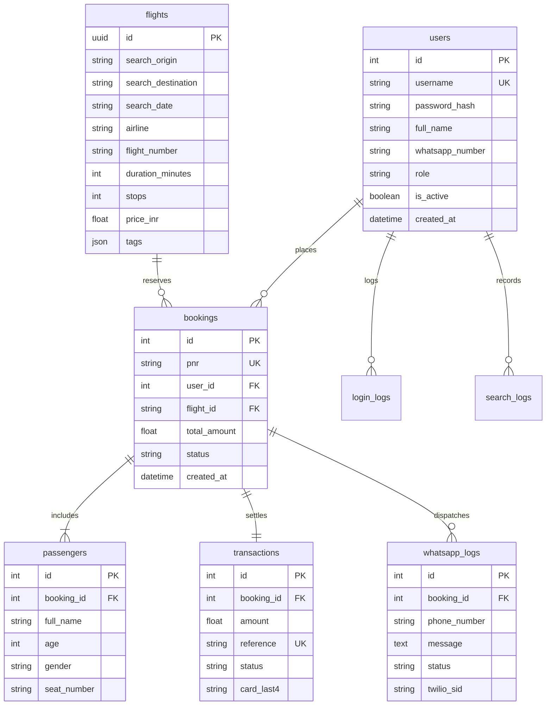

# ✈️ SkyBook: Flight Ticket Booking & Telemetry Platform

SkyBook is a full-stack, enterprise-grade flight booking platform built for a senior engineer interview demo. It connects Kerala's international airports to key Arabian Gulf hubs with an intelligent AI rate-tracking engine, persistent price locking, instant unique 6-character PNR issuance, background WhatsApp e-ticket dispatch, and a mission-control Admin Operations portal.

---

## 🏗️ Architecture & Technology Stack

| Layer | Technologies |
| :--- | :--- |
| **Backend API** | **FastAPI** (Python 3.11), **SQLAlchemy 2.0**, **Alembic**, **Pydantic v2**, **Uvicorn** |
| **Database** | **PostgreSQL 15** (with zero-config SQLite automatic development fallback) |
| **Auth & Security** | **JWT** (access tokens, 60-min expiry), **bcrypt** password hashing, **RBAC** (`user` & `admin`), login rate-limiter |
| **AI Rate Tracker** | **Google Gemini API** (with xAI Grok compatibility & deterministic offline generator fallback) |
| **WhatsApp Dispatch** | **Twilio WhatsApp API** (sandbox) invoked non-blocking via FastAPI `BackgroundTasks` |
| **Frontend Client** | **React 18**, **Vite**, **React Router v6**, **Axios**, Vanilla CSS Design System |
| **Infrastructure** | **Docker**, **Docker Compose**, multi-stage container builds |

---

## 🚀 One-Command Start (Docker)

To launch the entire platform (PostgreSQL + FastAPI Backend + React Vite Frontend) with a single command:

```bash
docker compose up --build
```

Once running:
- **Frontend Web App:** [http://localhost:5173](http://localhost:5173)
- **Backend Swagger UI:** [http://localhost:8000/docs](http://localhost:8000/docs)
- **Backend OpenAPI Spec:** [http://localhost:8000/openapi.json](http://localhost:8000/openapi.json)

---

## 🔑 Default Seeded Credentials

On initial startup, the backend automatically provisions an administrator account:

| Role | Username | Password | Full Name | Access Privileges |
| :--- | :--- | :--- | :--- | :--- |
| **Admin** | `admin` | `Admin@123` | SkyBook Administrator | Mission Operations, User Logs, Search Audits, Bookings & Revenue |
| **User** | Register any new account on the UI | (min 6 chars) | Any Name | Flight search, seat booking, payment simulation, My Trips |

*(Configurable via environment variables `ADMIN_USERNAME` and `ADMIN_PASSWORD`)*.

---

## 🛫 Flight Data & Supported Air Corridors

SkyBook focuses on the high-demand **Kerala ➔ Arabian Gulf** corridor:

- **Kerala Origins (4):**
  - Kochi (`COK` - Cochin International)
  - Kozhikode (`CCJ` - Calicut International)
  - Thiruvananthapuram (`TRV` - Trivandrum International)
  - Kannur (`CNN` - Kannur International)
- **Gulf Destinations (5):**
  - Dubai (`DXB`)
  - Abu Dhabi (`AUH`)
  - Doha (`DOH`)
  - Kuwait City (`KWI`)
  - Muscat (`MCT`)

### Operating Airlines
Emirates, Air India Express, IndiGo, Qatar Airways, Etihad Airways, Kuwait Airways, Oman Air, flydubai.

### Rate Tracker & Resilience Engine
1. **Gemini / Grok LLM Pricing:** When a user initiates a search, the backend calls the LLM with a strict JSON system prompt to generate 8–10 realistic itineraries with varied stops (direct, 1-stop, 2-stop), layovers, and pricing.
2. **Pydantic Validation & Retry:** Automatically validates output schema. If invalid JSON is encountered, it retries.
3. **Deterministic Local Fallback:** If the API key is unavailable, expired, or network drops, a deterministic cryptographic fallback generates realistic itineraries so the app **never breaks**.
4. **Price Lock & 30-Minute DB Cache:** Every generated flight is stored with a UUID in the `flights` table. Searches for the same route and date within 30 minutes are served from the cache, ensuring the price displayed during search is **exactly the price booked**.
5. **Computed Badges & Comparison:** Backend calculates value tags (`Cheapest`, `Fastest`, `Fewest stops`, `Best value`) and exact price differences per airline relative to the lowest available fare.

---

## 🛠️ Local Development (Without Docker)

You can also run backend and frontend locally on your host machine:

### 1. Backend Setup
```bash
cd backend
python -m venv venv

# Windows
venv\Scripts\activate
# Linux/macOS
source venv/bin/activate

pip install -r requirements.txt
uvicorn app.main:app --reload --port 8000
```
*(If PostgreSQL is not running locally, the backend gracefully initializes `sqlite:///./skybook.db` with zero configuration).*

### 2. Frontend Setup
```bash
cd frontend
npm install
npm run dev
```
Open [http://localhost:5173](http://localhost:5173).

---

## 🧪 Running Pytest Unit Tests

Unit tests cover authentication, validation, rate limits, flight searches, and 6-character PNR uniqueness:

```bash
cd backend
pytest -v
```

---

## 📊 Database Schema (8 Tables)



---

## 🌟 Key Features Demonstration Walkthrough

1. **Authentication & Security:**
   - Register with E.164 phone validation (`+91...`).
   - Rate-limited login (max 5 failed attempts per 5 minutes per IP/username).
   - JWT tokens stored client-side in `localStorage`.
2. **Flight Search & Rate Comparison:**
   - Search Kerala origins to Gulf destinations.
   - Filter and sort by Cheapest, Fastest, Fewest Stops, or Best Value.
   - Expand Airline Comparison Table to contrast fares across carriers.
3. **Seamless Checkout & Mock Payment:**
   - Multi-passenger form (names, ages, genders, passport numbers, seat assignments).
   - Live simulated credit card interface with real-time Luhn/spacing formatting.
4. **Instant PNR & WhatsApp Telemetry:**
   - Generates unique 6-character uppercase alphanumeric PNR (e.g. `SB8K2P`).
   - Dispatches background WhatsApp message via Twilio (mock delivery logged if sandbox is in test mode).
   - E-ticket confirmation popup with printable layout.
5. **Admin Mission Operations:**
   - Login as `admin` / `Admin@123`.
   - Access `/admin` to view live KPI cards, interactive Top Routes Bar Chart, and paginated, searchable tables for Users, Login Audit Logs, Search Logs, Bookings, and Financial Transactions.
